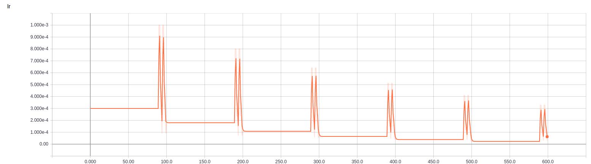
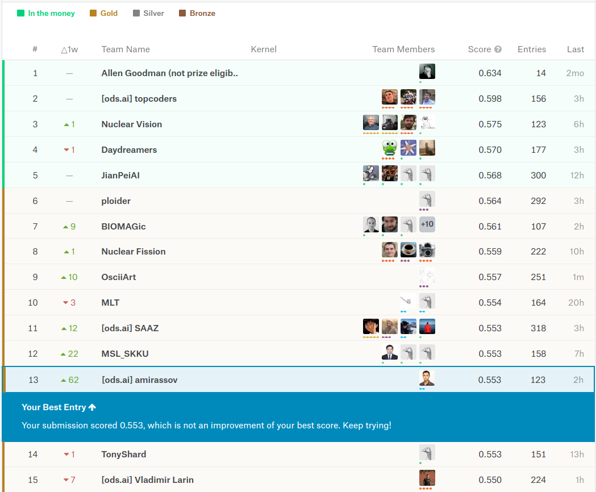
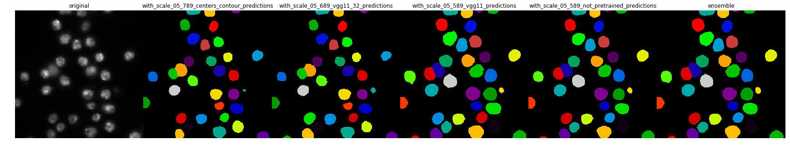
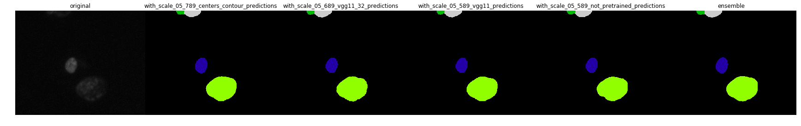
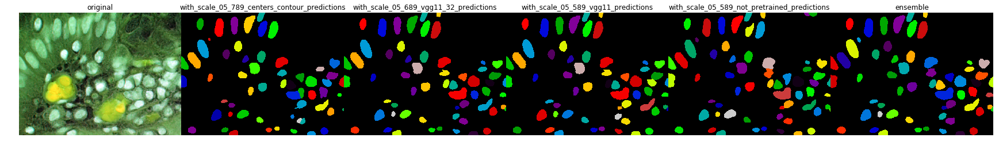

Первый этап конкурса закончился. Сейчас готовлю предсказания для данных второго этапа (3016 изображений).


# Data-Science-Bowl-2018

Данный репозиторий содержит мое решение конкурса [Data-Science-Bowl-2018](https://www.kaggle.com/c/data-science-bowl-2018).

## Описание финального решения:

Задача конкурса заключается в обнаружении ядер в гистологических изображениях.
Организаторы утверждают, что обнаружение ядер клеток позволит исследователям идентифицировать каждую отдельную клетку и
измерить ее реакцию на различные методы лечения.

Обучающая выборка содержит `664` изображений, а тестовая `67`. Ниже представлены примеры изображений из обучающей выборки:


#### Предобработка
##### Цвет
Видно, что изображения имеют разные оттенки цвета. Поэтому изображения, у которых цвет фона розовый или белый, были инвертированы. 
Для этого я использовал простое эвристическое правило:
```python
if np.mean(image[..., 0]) > 100:
    image = 255 - image
```

##### Размер
Все изображения были масштабированы так, 
чтобы медиана площадей (количество пикселей) клеток на изображении была равна `250`.

Для изображений из обучающей выборки известны площади клеток, а для тестовой выборки нет. 
Поэтому я использовал следующий алгоритм:
1. Обучаю модель на изображениях без масштабирования
2. Предсказываю маски для тестовых картинок с помощью этой модели
3. Сегментирую клетки
3. Считаю площадь для тестовых картинок 

#### Архитектура сети
Для решения задач данного типа популярны две архитектуры нейронной сети:

* [MaskRCNN](https://arxiv.org/abs/1703.06870)
* [UNet](https://arxiv.org/abs/1505.04597) с постобработкой для сегментации ядер

Из соображений простоты и работоспособности в данной задаче была выбрана архитектура `UNet`, которая решает задачу бинарной сегментации.

В работе [TernausNet: U-Net with VGG11 Encoder Pre-Trained on ImageNet for Image Segmentation](https://arxiv.org/abs/1801.05746)
было показано, что использование предобученной нейронной сети в качестве энкодера для `UNet` улучшает качество алгоритма. Поэтому будем использовать `UNet` с предобученным энкодером на наборе данных `ImageNet`.

В качестве энкодеров будем использовать `Resnet34` и `VGG11`.

#### Функция ошибок
В качестве функции ошибок использовались следующие функции:
1. `BceLogDice = bce - log(dice)`
1. `BceDice = bce - dice`


#### Аугментация
Нейронная сеть обучалась на случайных кропах размера `256 X 256`. Изображения меньшего размера были дополнены до нужного размера зеркальным отражением границ.

В качестве преобразований были выбраны следующие операции:
VerticalFlip, HorizontalFlip, Transpose, ShiftScaleRotate, Distort, RandomBrightness, RandomContrast.

#### Кросс-валидация
Мы имеем изображения разных оттенков.
Поэтому выборка была разбита на две части в пропорции `597/67` на обучающую и валидационную выборку так,
чтобы изображения разных оттенков присутствовали примерно в такой же пропорции, как в размеченной и тестовой выборке.

На валидационной выборке подбирались параметры нейронной сети и алгоритма постобработки. 
После того, как были выбраны подходящие параметры, я обучал модели на всех изображениях. 

#### Процесс обучения
Все модели обучались по следующему принципу: 
1. Обучаем с постоянным `learning_rate` (примерно `0.0003`) до выхода на плато (примерно 90 эпох)
1. Запускаем две итерации `cyclic learning rate`, то есть начиная с какого-то большого `learning_rate` спускаемся вниз
1. Уменьшаем исходный `learning_rate` и верхнюю границу `cyclic learning rate`
1. Если количество эпох меньше заранее заданного значения (примерно `700`), то возвращаемся к шагу 1.

Ниже представлен график зависимости `learning_rate` от номера эпохи для одной из моделей:



#### Предсказание
Тестовые изображения дополнялись до нужного размера (высота и широта кратно `64`) зеркальным отражением границ и пропускались через нейронную сеть батчами размера `1`. 
Для предсказания масок использовался метод [Test Time Augmentation (TTA)](http://benanne.github.io/2015/03/17/plankton.html), суть которого заключается в применении аугментаций к тестовым изображениям при формировании предсказаний.
Дальше усреднением обратных преобразований предсказанных масок получаем итоговый ответ.


#### Постобработка
`UNet` выдает вероятность маски, которую нужно сегментировать на отдельные ядра. В качестве алгоритма сегментации использовался [`watershed`](https://docs.opencv.org/3.1.0/d3/db4/tutorial_py_watershed.html).
Алгоритм на вход принимает инвертированную вероятность маски, как функцию интенсивности, и маркеры, которые указывают, какие области должны быть объединены, а какие нет. Поэтому `UNet-ом` предсказывалась не только маска, но и центры каждого ядра.
Дальше центры были использованы, как маркеры для `watershed`.

Центры масок вычислялись с помощью алгоритма `distance transform`. Для каждого ядра:
1. Считалось расстояние до границы ядра
2. Расстояния нормировались делением на максимальное расстояние. В итоге получаем, что расстояние для центра ядра равно единице, для границ равно нулю.
3. Если расстояние больше чем `threshold`, то точка является центром.


#### Модели
В итоге я обучил `9` моделей с архитектурой `UNet` с разными энкодерами, функциями ошибок и ответами (в скобках указан `threshold`):

| Энкодер  | Ответы                    | Функция ошибок | Количество эпох | Размер батча | Заморозка энкодера | Качество на Public Leaderboard |
|----------|---------------------------|----------------|-----------------|--------------|------|--------------------------------|
| Resnet34 | маска+центр (0.5)+граница (0.5)      | BceLogDice     | 589  | 16          | Да                 | 0.536                          |
| Resnet34 | маска+центр (0.5)+центр (0.5)         | BceLogDice     | 689 | 16           | Да                 | 0.537                          |
| VGG11    | маска+центр (0.5)+граница (0.5)       | BceLogDice     | 589 | 16            | Да                 | 0.535                          |
| Resnet34 | маска+центр (0.5)+граница (0.5)       | BceLogDice     | 589 | 16           | Нет                | 0.533                          |
| Resnet34 | маска+центр (0.5)+граница (0.5)       | BceDice        | 589 | 32           | Да                 | 0.540                          |
| VGG11    | маска+центр (0.5)+центр (0.5)         | BceDice        | 689 | 32           | Да                 | 0.535                          |
| VGG11    | маска+центр (0.5)+граница (0.5)       | BceDice        | 689 | 32            | Да                 | 0.534                          |
| Resnet34 | маска+центр (0.5)+граница (0.5)+центр (0.3) | BceDice        | 789 | 32            | Да                 | 0.500                          |
| VGG11    | маска+центр (0.5)+граница (0.5)+центр (0.3) | BceDice        | 789 | 32            | Да                 | 0.529                          |

Итоговый ансамбль является взвешенной суммой данных моделей с весами `[0.10, 0.13, 0.13, 0.08, 0.13, 0.13, 0.12, 0.09, 0.09]`. Качество ансамбля на Public Leaderboard: `0.553`:



#### Результаты:
Примеры работы алгоритма на тестовых изображениях:








## Инструкция
#### Подготовка данных
1. Обработка дополнительных данных: `data_1_extra_data.ipynb`
1. Сохранение выборки для обучения модели без масштабирования, где ответами являются маска, центр и граница (`threshold=0.5`) и граница: `data_1_without_scale_05.ipynb`
1. Сохранение выборки для обучения модели с масштабированием, где ответами являются маска, центр и граница (`threshold=0.5`)  и граница: `data_2_with_scale_05.ipynb`
1. Сохранение выборки для обучения модели с масштабированием, где ответами являются маска и два центра (`threshold = 0.5 и 0.3`) : `data_3_with_scale_05_03_only_centers.ipynb`
1. Сохранение выборки для обучения модели с масштабированием, где ответами являются маска, граница и два центра (`threshold = 0.5 и 0.3`) : `data_5_with_scale_05_centers_contour.ipynb`


#### Обучение моделей
1. train_1_without_scale_05.ipynb
1. train_2_with_scale_05.ipynb
1. train_3_with_scale_05_03_only_centers.ipynb
1. train_4_with_scale_05_vgg11-600.ipynb
1. train_5_with_scale_not_pretrained.ipynb
1. train_6_with_scale_05_32_not_logarithm-vgg11.ipynb
1. train_7_with_scale_05_centers_contour.ipynb
1. train_8_with_scale_05_32_not_logarithm.ipynb
1. train_9_with_scale_05_centers_contour_vgg11.ipynb

#### Предсказание
1. Предсказание ответов для теста без масштабирования: `predict_1_without_scale_predict.ipynb`
1. Подготовка тестовых данных с масштабированием: `predict_2_with_scale_test.ipynb`
1. Итоговые предсказания для теста и ансамблирование: `predict_3_ensemble.ipynb`


## Машины
1. p2.xlarge с NVIDIA Tesla K80
1. p3.2xlarge с NVIDIA Tesla V100 (обучение всех моделей занимает ~ 22 часа)


## Ссылки:
- https://github.com/ternaus/TernausNet
- https://github.com/ternaus/robot-surgery-segmentation
- https://github.com/asanakoy/kaggle_carvana_segmentation
- https://github.com/lopuhin/mapillary-vistas-2017

## Статьи:
- [U-Net: Convolutional Networks for Biomedical Image Segmentation](https://arxiv.org/abs/1505.04597)
- [Cyclical Learning Rates for Training Neural Networks](https://arxiv.org/abs/1506.01186)
- [Deep Watershed Transform for Instance Segmentation](https://arxiv.org/abs/1611.08303)
- [MULTICLASS WEIGHTED LOSS FOR INSTANCE SEGMENTATION OF CLUTTERED CELLS](https://arxiv.org/abs/1802.07465)
- [A DISCIPLINED APPROACH TO NEURAL NETWORK HYPER-PARAMETERS: PART 1 – LEARNING RATE, BATCH SIZE, MOMENTUM, AND WEIGHT DECAY](https://arxiv.org/abs/1803.09820)
- [DON’T DECAY THE LEARNING RATE, INCREASE THE BATCH SIZE](https://arxiv.org/abs/1711.00489)
