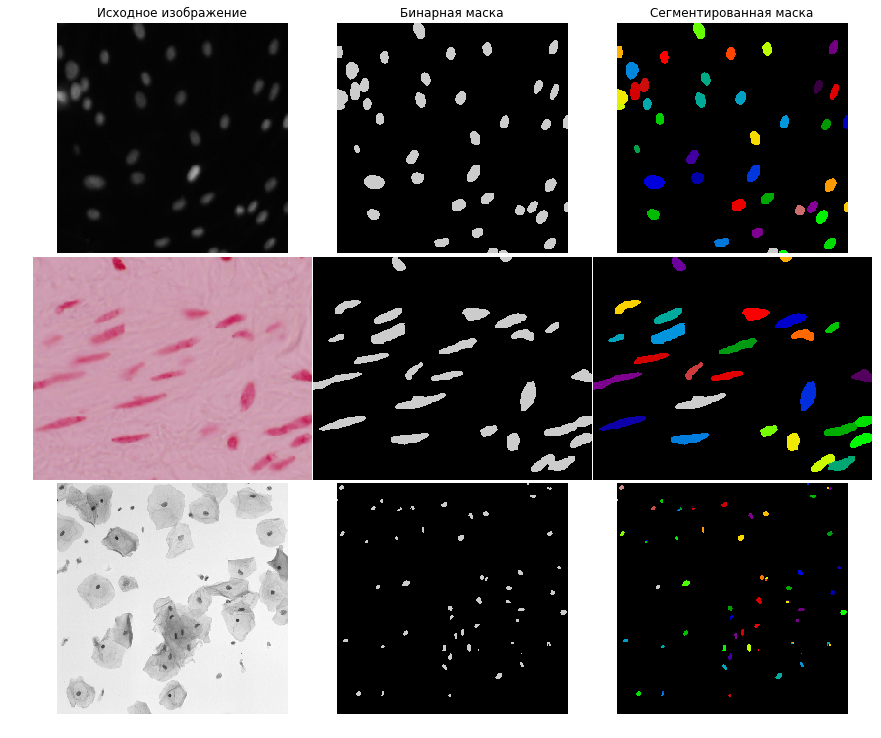
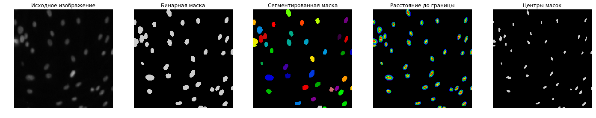
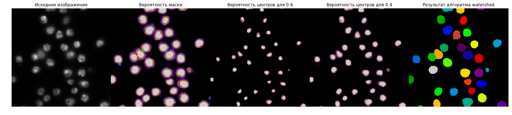
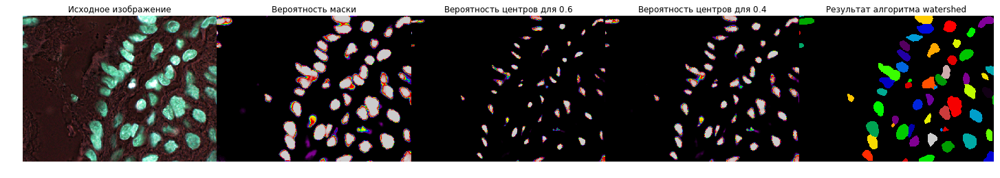
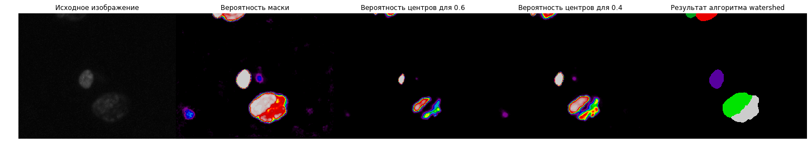

# Data-Science-Bowl-2018

Данный репозиторий содержит мое решение конкурса [Data-Science-Bowl-2018](https://www.kaggle.com/c/data-science-bowl-2018).

## Описание текущего решения:

Задача конкурса заключается в обнаружении ядер в гистологических изображениях.
Организаторы утверждают, что обнаружение ядер клеток позволит исследователям идентифицировать каждую отдельную клетку и
измерить ее реакцию на различные методы лечения.

Обучающая выборка содержит `664` изображений, а тестовая `67`. Ниже представлены примеры изображений из обучающей выборки:

#### Предобработка
Видно, что изображения имеют разные оттенки цвета. Поэтому изображения, у которых цвет фона имеет розовый или белый оттенок, были инвертированы.

* Есть идея привести ядра к одному размеру или форме, чтобы облегчить работу нейронной сети

#### Архитектура сети
Для решения задач данного типа популярны две архитектуры нейронной сети:

* [MaskRCNN](https://arxiv.org/abs/1703.06870)
* [UNet](https://arxiv.org/abs/1505.04597) с постобработкой для сегментации ядер

Из соображений простоты и работоспособности в данной задаче была выбрана архитектура `UNet`, которая решает задачу бинарной сегментации.

В работе [TernausNet: U-Net with VGG11 Encoder Pre-Trained on ImageNet for Image Segmentation](https://arxiv.org/abs/1801.05746)
было показано, что использование предобученной нейронной сети в качестве энкодера для `UNet` улучшает качество алгоритма. Поэтому будем использовать `UNet` с предобученным `ResNet34` энкодером на наборе данных `ImageNet`.

#### Функция ошибок
Пока в качестве функции ошибок используется разница между бинарной кросс-энтропией и `log(dice)`.

* Есть идея считать взвешенную функцию потерь: увеличивать веса на границах ядер,
чтобы добиться более четкого разделения касающиехся объектов.
Например, как тут
[MULTICLASS WEIGHTED LOSS FOR INSTANCE SEGMENTATION OF CLUTTERED CELLS](https://arxiv.org/abs/1802.07465).

#### Аугментация
Нейронная сеть обучалась на случайных кропах размера `256 X 256`. В качестве преобразований были выбраны следующие операции:
VerticalFlip, HorizontalFlip, Transpose, ShiftScaleRotate, Distort1, RandomBrightness, RandomContrast.

#### Кросс-валидация
Мы имеем изображения разных размеров и оттенков.
Поэтому выборка была разбита на две части в пропорции `597/67` на обучающую и валидационную выборку так,
чтобы изображения разных оттенков присутствовали примерно в такой же пропорции, как в размеченной и тестовой выборке.

На валидационной выборке подбирались параметры нейронной сети и алгоритма постобработки.

#### Процесс обучения
Обучение длилось 200 эпох: первые 100 эпох с `learning_rate=0.0003`, дальше 100 эпох с `learning_rate=0.0001`.

#### Постобработка
Для предсказания масок использовался метод [Test Time Augmentation (TTA)](http://benanne.github.io/2015/03/17/plankton.html), суть которого заключается в применении аугментаций к тестовым изображениям при формировании предсказаний.
Дальше усреднением обратных преобразований предсказанных масок получаем итоговый ответ.

`UNet` выдает вероятность маски, которую нужно сегментировать на отдельные ядра. В качестве алгоритма сегментации использовался [`watershed`](https://docs.opencv.org/3.1.0/d3/db4/tutorial_py_watershed.html).
Алгоритм на вход принимает инвертированную вероятность маски, как функцию интенсивности, и маркеры, которые указывают, какие области должны быть объединены, а какие нет. Поэтому `UNet-ом` предсказывалась не только маска, но и центры каждого ядра.
Дальше центры были использованы, как маркеры для `watershed`.

Центры масок вычислялись с помощью алгоритма `distance transform`. Для каждого ядра:
1. Считалось расстояние до границы ядра
2. Расстояния нормировались делением на максимальное расстояние. В итоге получаем, что расстояние для центра ядра равно единице, для границ равно нулю.
3. Если расстояние больше чем `threshold`, то точка является центром.

Я рассмотрел `threshold=0.6` и `threshold=0.4`, то есть нейронная сеть училась предсказывать 3-х канальное изображение: маски ядер, два центра с разными значениями порогов.

* Есть идея предсказывать сразу карту расстояний с помощью `UNet`.

#### Результаты:
Примеры работы алгоритма `UNet + watershed` на тестовых изображениях:

## Ссылки:
- https://github.com/ternaus/TernausNet
- https://github.com/ternaus/robot-surgery-segmentation
- https://github.com/asanakoy/kaggle_carvana_segmentation
- https://github.com/lopuhin/mapillary-vistas-2017

## Статьи:
- [U-Net: Convolutional Networks for Biomedical Image Segmentation](https://arxiv.org/abs/1505.04597)
- [Cyclical Learning Rates for Training Neural Networks](https://arxiv.org/abs/1506.01186)
- [Deep Watershed Transform for Instance Segmentation](https://arxiv.org/abs/1611.08303)
- [MULTICLASS WEIGHTED LOSS FOR INSTANCE SEGMENTATION OF CLUTTERED CELLS](https://arxiv.org/abs/1802.07465)
- [A DISCIPLINED APPROACH TO NEURAL NETWORK HYPER-PARAMETERS: PART 1 – LEARNING RATE, BATCH SIZE, MOMENTUM, AND WEIGHT DECAY](https://arxiv.org/abs/1803.09820)
- [DON’T DECAY THE LEARNING RATE, INCREASE THE BATCH SIZE](https://arxiv.org/abs/1711.00489)
